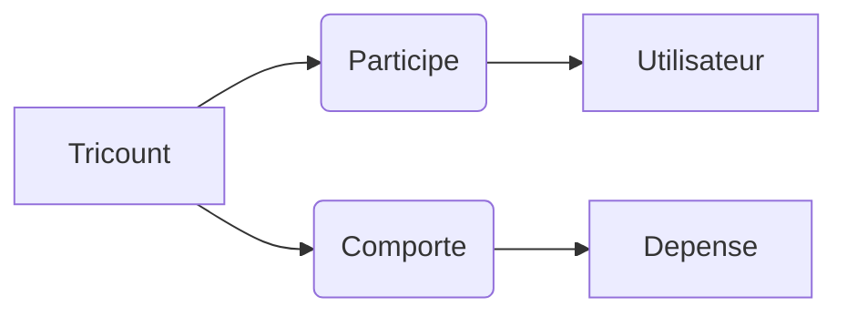

# Tricount

Salut ! Ceci est Webservice réalisé en Golang qui reprend le concept de l'application Tricount dont voici le descriptif :

>**Idéal quand vous organisez des activités de groupes comme des city-trips, des voyages, des restaurants ou quand vous partagez le loyer avec vos colocataires !**
**Simplifiez-vous la vie, chaque utilisateur ajoute ses propres dépenses et Tricount s'occupe de calculer ce que vous devez et à qui afin d'équilibrer le total du groupe.**

# Fonctionnalités

L'application permet pour l'instant de :
- **Créer** votre tricount et entrez les noms des participants
- **Ajoutez** des dépenses et voyez le montant total

**A venir :**
- **Supprimer** les tricount ou les utilisateurs
- **Ajouter** des remboursements pour régler vos dettes

## MCD de l'application

Realisé par :
**Toufic** : [email](emilien.meffe@gmail.com)
**corentin-boscher**
